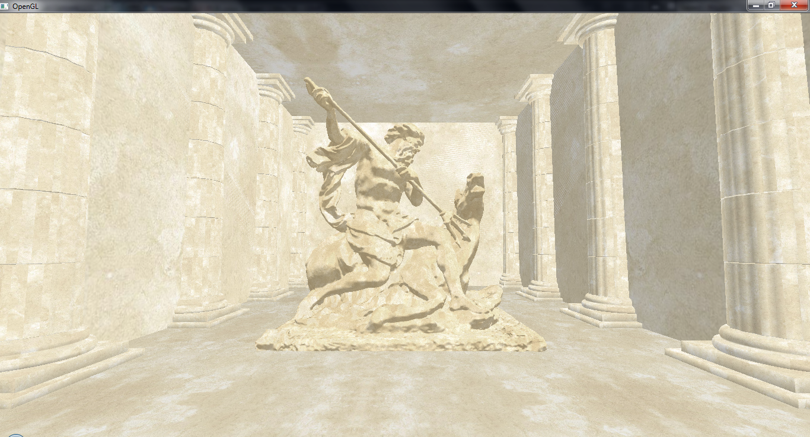

# OpenGL2 3D Greek Temple First Persion View 

University project for "Computer graphics". 3D greek temple with first person view written in C++ using OpenGL2 and GLM libraries.

## Prerequisites

* CodeBlocks

## Controls

W, S, A, D - use to move.

## Authors

- Tomasz Pućka - models, lighting, texturing
- Bartosz Żywicki - camera, collision detection

## Screenshots

